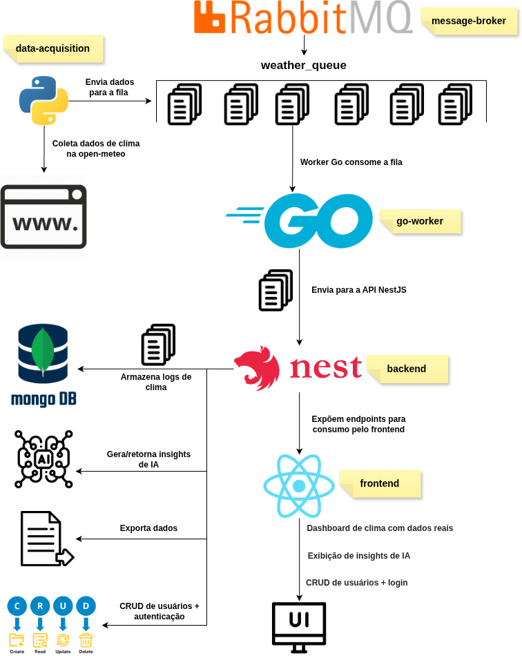

# Sistema de coleta e processamento de dados climáticos

Este projeto é uma aplicação full-stack para **coleta, enfileiramento, processamento, armazenamento e exibição de dados de clima**, usando **Python**, **Go**, e **RabbitMQ**, **Nest** e **React**.

Este projeto é estruturado seguindo uma arquitetura de **micro serviços**, onde cada responsabilidade do sistema é isolada em um serviço independente. Isso facilita a escalabilidade, manutenção e evolução da aplicação ao longo do tempo.

A estrutura geral do projeto é:

```
├── backend
├── data-acquisition
├── db
├── frontend
└── go-worker
```



---

### 1. **Data Acquisition (Python Producer)**

- Serviço responsável por coletar dados climáticos.
- Envia mensagens para a fila RabbitMQ `weather_queue`.
- Estrutura de mensagem esperada:

```json
{
  "city": "Belo Horizonte",
  "timestamp_utc": "2025-11-22T03:38:00Z",
  "temperature_c": 21.5,
  "humidity_pct": 76,
  "wind_speed_kmh": 10.4,
  "condition_text": "Nublado",
  "rain_probability_pct": 42
}
```

---

### 2. **Go Worker** 

**worker em Go** que consome mensagens de clima (`WeatherMessage`) de uma fila RabbitMQ (`weather_queue`) e as processa. As mensagens são exibidas no console em formato de log.

## Funcionalidades

- Conecta ao RabbitMQ usando URL configurável via variável de ambiente.
- Consome mensagens da fila `weather_queue`.
- Exibe o **JSON formatado** das mensagens no console.
- Confirma (ack) cada mensagem após processamento.

---

